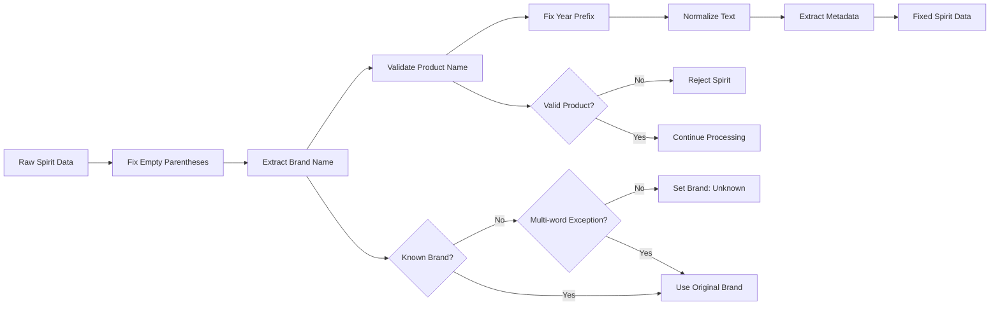
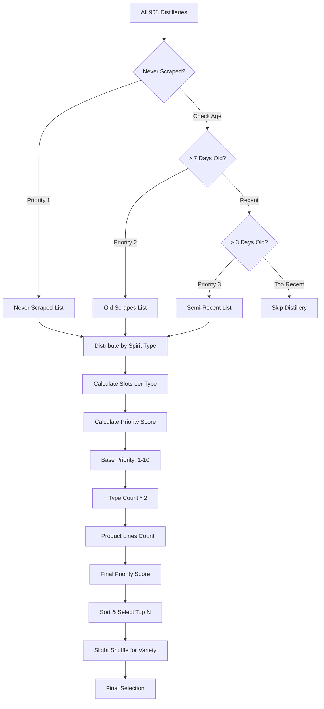
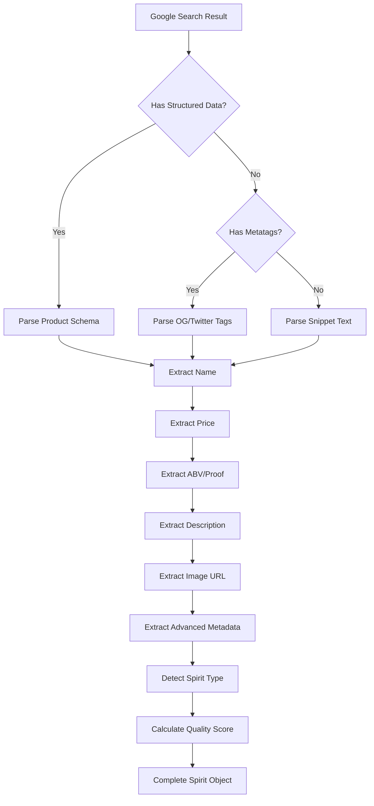
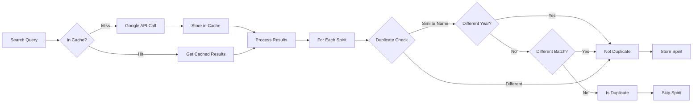
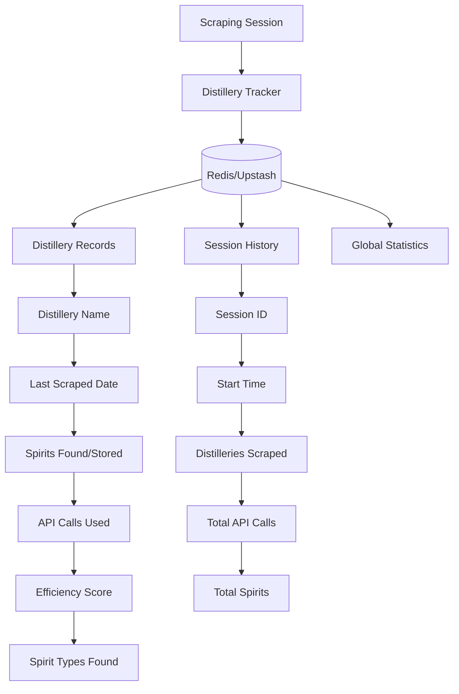

# V2.5.6 Spirits Scraper System Flowchart

## Overview
This document provides a visual representation of how the V2.5.6 intelligent distillery scraper works, from command execution to data storage.

## Main Scraper Flow

```mermaid
flowchart TD
    Start([User runs: npm run scrape-catalogs]) --> ParseOptions{Parse Command Options}
    
    ParseOptions --> ClearTracking{Clear Tracking?}
    ClearTracking -->|Yes| ClearData[Clear All Tracking Data]
    ClearData --> End1([End])
    
    ClearTracking -->|No| InitTracker[Initialize Distillery Tracker]
    InitTracker --> StartSession[Start New Scraping Session]
    StartSession --> ShowStats[Display Previous Scraping Stats]
    
    ShowStats --> SelectMode{Specific Distilleries?}
    
    SelectMode -->|Yes| FindSpecific[Find Specified Distilleries]
    SelectMode -->|No| IntelligentSelect[Intelligent Selection Algorithm]
    
    IntelligentSelect --> GetUnscraped[Get Unscraped Distilleries]
    GetUnscraped --> FilterByAge[Filter by Days Since Last Scrape]
    FilterByAge --> GroupByType[Group by Spirit Type]
    GroupByType --> PrioritySort[Sort by Priority & Product Lines]
    PrioritySort --> SelectDistilleries[Select Optimal Distilleries]
    
    FindSpecific --> ValidateDistilleries{Valid Distilleries?}
    ValidateDistilleries -->|No| Error1[Show Error]
    Error1 --> End2([End])
    ValidateDistilleries -->|Yes| SelectDistilleries
    
    SelectDistilleries --> ShowSelected[Display Selected Distilleries & Type Coverage]
    ShowSelected --> ProcessLoop{More Distilleries & API Calls?}
    
    ProcessLoop -->|No| ShowSummary[Display Final Summary]
    ProcessLoop -->|Yes| CheckRecord[Check Distillery Record]
    
    CheckRecord --> RecentlyCached{Scraped < 3 days ago?}
    RecentlyCached -->|Yes| ShowCacheNotice[Show Cache Notice]
    RecentlyCached -->|No| GenerateQueries[Generate Smart Queries]
    ShowCacheNotice --> GenerateQueries
    
    GenerateQueries --> ProcessQueries{Process Each Query}
    ProcessQueries --> CheckCache{Query Cached?}
    
    CheckCache -->|Yes| UseCached[Use Cached Results]
    CheckCache -->|No| CallAPI[Call Google Search API]
    
    CallAPI --> ProcessResults[Process Search Results]
    UseCached --> ProcessResults
    
    ProcessResults --> ExtractSpirits[Extract Spirits from Results]
    ExtractSpirits --> ValidateSpirit{Valid Product?}
    
    ValidateSpirit -->|No| SkipSpirit[Skip Non-Product]
    ValidateSpirit -->|Yes| ApplyFixes[Apply V2.5.6 Fixes]
    
    SkipSpirit --> NextSpirit{More Spirits?}
    ApplyFixes --> StoreSpirit[Store in Database]
    
    StoreSpirit --> TrackType[Track Spirit Type]
    TrackType --> UpdateMetrics[Update Metrics]
    UpdateMetrics --> NextSpirit
    
    NextSpirit -->|Yes| ValidateSpirit
    NextSpirit -->|No| RecordScrape[Record Distillery Scrape]
    
    RecordScrape --> UpdateSession[Update Session Progress]
    UpdateSession --> ProcessLoop
    
    ShowSummary --> CheckDedup{Stored >= 50 Spirits?}
    CheckDedup -->|Yes| RunDedup[Run Auto-Deduplication]
    CheckDedup -->|No| ShowRecommend[Show Next Run Recommendations]
    RunDedup --> ShowRecommend
    ShowRecommend --> End3([End])
```



## V2.5.6 Fixes Application Flow



## Intelligent Selection Algorithm



## Data Extraction Pipeline



## Cache & Deduplication Flow



## Session Tracking Structure



## Key Features Highlighted

1. **Intelligent Selection**: Prioritizes unscraped distilleries and ensures coverage across all spirit types
2. **Cache Awareness**: Checks cache before making API calls, saving time and money
3. **V2.5.6 Fixes**: Applies comprehensive fixes to ensure data quality
4. **Deduplication**: Smart duplicate detection that preserves variations (different years, batches)
5. **Session Tracking**: Remembers what was scraped to avoid redundant work
6. **Multi-Spirit Support**: Works with bourbon, scotch, vodka, gin, rum, tequila, and more

## Usage Examples

```bash
# Default intelligent scraping (100 API calls)
npm run scrape-catalogs

# Custom API calls
npm run scrape-catalogs -- -a 200

# Specific distilleries
npm run scrape-catalogs -- -d "Buffalo Trace,Glenfiddich,Grey Goose"

# Clear tracking and start fresh
npm run scrape-catalogs -- --clear-tracking
```

## Performance Metrics

- **Efficiency Target**: 5-10 spirits per API call
- **Cache Hit Rate**: Typically 20-40% after initial runs
- **Coverage**: All major spirit categories
- **Deduplication**: ~95% accuracy with year/batch awareness
- **Storage Rate**: 50-80% of found spirits (after deduplication)