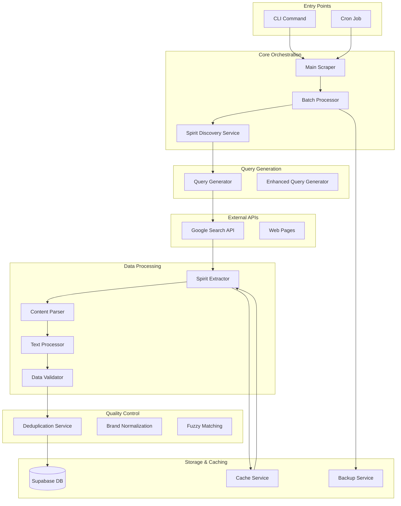
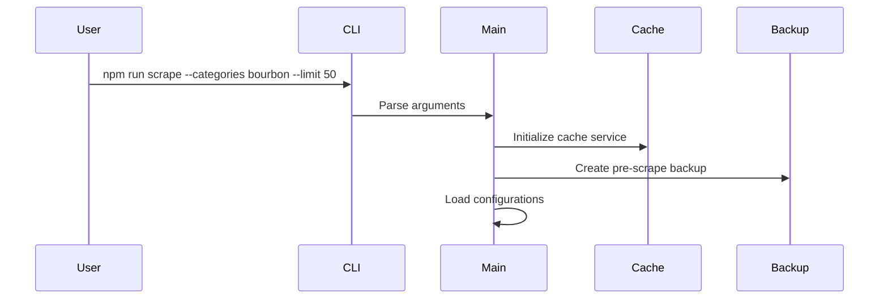
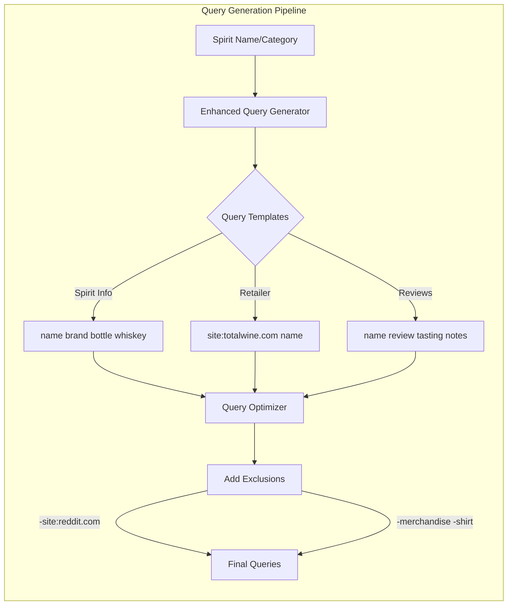
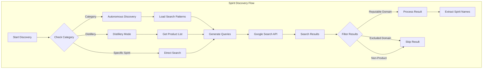
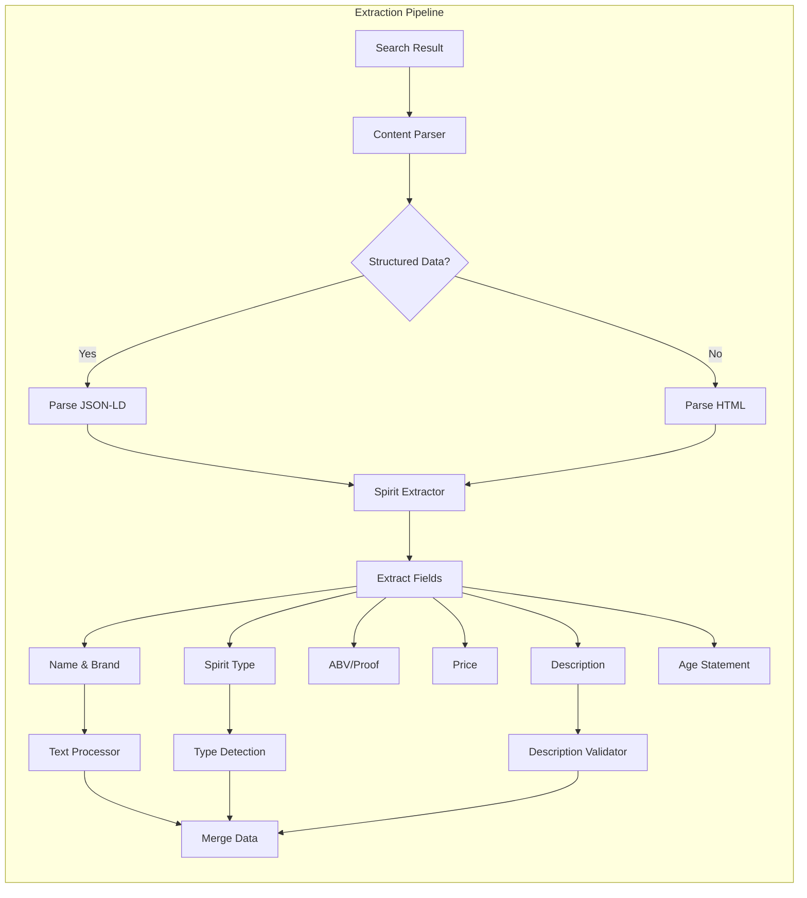
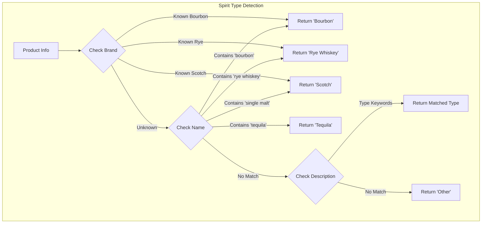
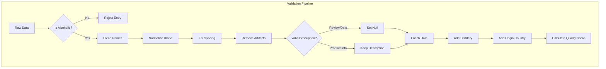
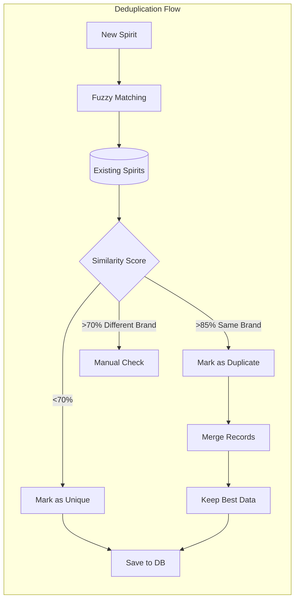
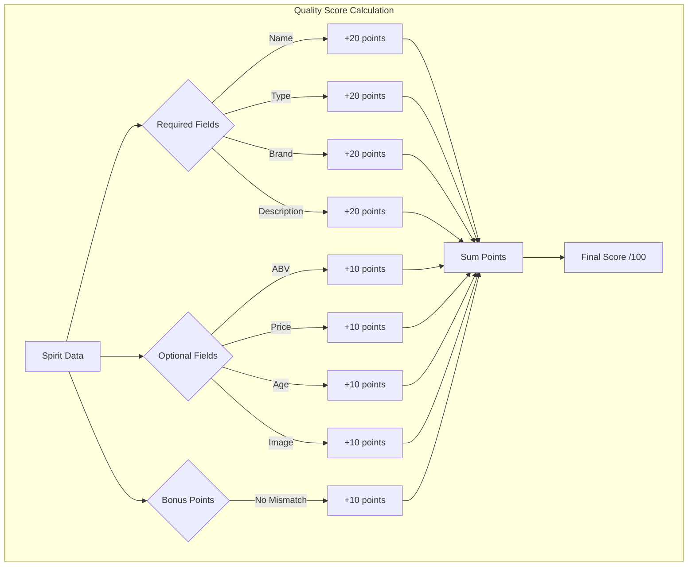
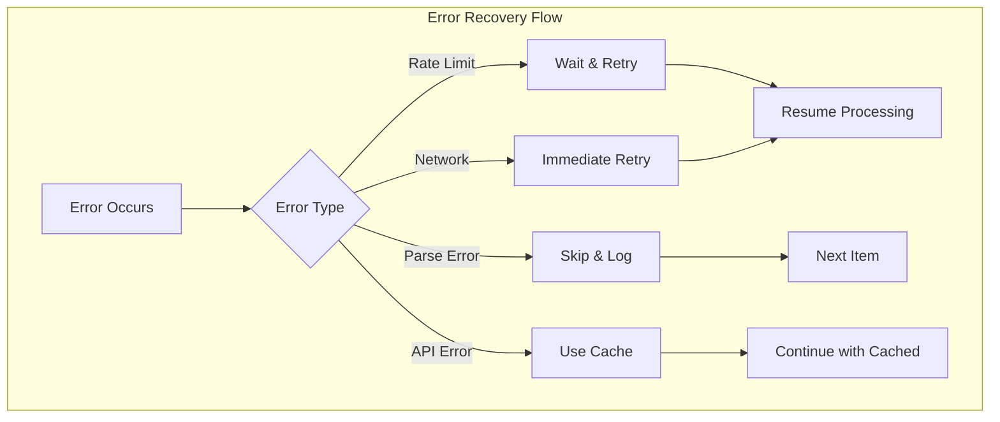

# Spirits Scraper Architecture & Flow Diagram

## Overview
This document provides a detailed visual and textual representation of how the spirits-scraper works during a scanning operation.

## High-Level Architecture Flow



## Detailed Component Flow

### 1. Entry & Initialization



### 2. Query Generation Phase



### 3. Discovery & Search Phase



### 4. Data Extraction Pipeline



### 5. Type Detection Logic



### 6. Data Validation & Cleaning



### 7. Deduplication Process



### 8. Quality Scoring



## Component Descriptions

### Core Services

1. **CLI (cli.ts)**
   - Parses command line arguments
   - Validates options
   - Initializes main scraper

2. **Main Scraper (index.ts)**
   - Orchestrates the entire process
   - Manages configuration
   - Handles errors and retries

3. **Batch Processor (batch-processor.ts)**
   - Manages concurrent operations
   - Rate limiting (100 queries/day)
   - Progress tracking
   - Real-time quality metrics

4. **Spirit Discovery Service (spirit-discovery.ts)**
   - Discovers actual spirit names from searches
   - Filters non-spirit results
   - Validates spirit names
   - Extracts from multiple sources

### Query Generation

5. **Query Generator (query-generator.ts)**
   - Generates targeted search queries
   - Adds site-specific operators
   - Excludes social media domains

6. **Enhanced Query Generator (enhanced-query-generator.ts)**
   - Adds merchandise exclusions
   - Optimizes for better results
   - Category-specific queries

### Data Processing

7. **Spirit Extractor (spirit-extractor.ts)**
   - Main extraction logic
   - Type detection
   - Field extraction
   - Quality scoring

8. **Content Parser (content-parser.ts)**
   - Parses HTML/JSON-LD
   - Extracts structured data
   - Price extraction
   - Review filtering

9. **Text Processor (text-processor.ts)**
   - Fixes spacing issues
   - Normalizes brands
   - Category detection
   - Age extraction

10. **Data Validator (data-validator.ts)**
    - Validates spirit data
    - Checks required fields
    - Description validation
    - Duplicate detection

### Quality Control

11. **Deduplication Service (deduplication-service.ts)**
    - Fuzzy name matching
    - Attribute-based comparison
    - Merge strategies
    - Threshold management

12. **Brand Normalization (brand-normalization.ts)**
    - Standardizes brand names
    - Fixes common variations
    - Maintains consistency

13. **Fuzzy Matching (fuzzy-matching.ts)**
    - String similarity algorithms
    - Weighted comparisons
    - Penalty calculations

### Storage & Caching

14. **Cache Service (cache-service.ts)**
    - Prevents duplicate API calls
    - 24-hour TTL
    - Auto-cleanup
    - JSON file storage

15. **Backup Service (backup-service.ts)**
    - Pre-scrape backups
    - Timestamped snapshots
    - Restore functionality
    - Data safety

16. **Supabase Storage (supabase-storage.ts)**
    - Database operations
    - Batch inserts/updates
    - Transaction management
    - Error handling

## Data Flow Example

Here's a complete example of scraping "Buffalo Trace Bourbon":

1. **User Input**: `npm run scrape --categories bourbon --limit 10`

2. **Query Generation**:
   ```
   - "Buffalo Trace Bourbon bottle whiskey"
   - "site:totalwine.com Buffalo Trace"
   - "Buffalo Trace bourbon -site:reddit.com -merchandise"
   ```

3. **Google Search**: Returns 10 results from various retailers

4. **Discovery Phase**:
   - Filters out reddit.com results
   - Finds "Buffalo Trace Kentucky Straight Bourbon Whiskey"
   - Extracts from totalwine.com product page

5. **Extraction**:
   - Name: "Buffalo Trace Kentucky Straight Bourbon Whiskey"
   - Brand: "Buffalo Trace"
   - Type: "Bourbon" (brand-based detection)
   - ABV: "45%"
   - Price: "$24.99"
   - Description: "This deep amber whiskey has a complex aroma..."

6. **Validation**:
   - ✓ Is alcoholic beverage
   - ✓ Valid product description
   - ✓ All required fields present

7. **Enrichment**:
   - Distillery: "Buffalo Trace Distillery"
   - Origin Country: "United States"
   - Quality Score: 95/100

8. **Deduplication**:
   - Checks against existing entries
   - No duplicates found
   - Saves to database

9. **Result**: High-quality spirit data ready for use!

## Error Handling & Recovery



## Performance Optimizations

1. **Caching**: Prevents redundant API calls
2. **Batch Processing**: Concurrent operations with limits
3. **Smart Retries**: Exponential backoff for rate limits
4. **Selective Parsing**: Only parse promising results
5. **Early Filtering**: Skip non-products before processing

## Configuration Files

- **Domain Lists**: Reputable retailers, excluded domains
- **Brand Mappings**: Brand to distillery relationships
- **Query Templates**: Optimized search patterns
- **Type Patterns**: Spirit type detection rules
- **Text Fixes**: Common text normalization patterns

This architecture ensures high-quality data extraction while respecting API limits and maintaining data integrity throughout the scraping process.